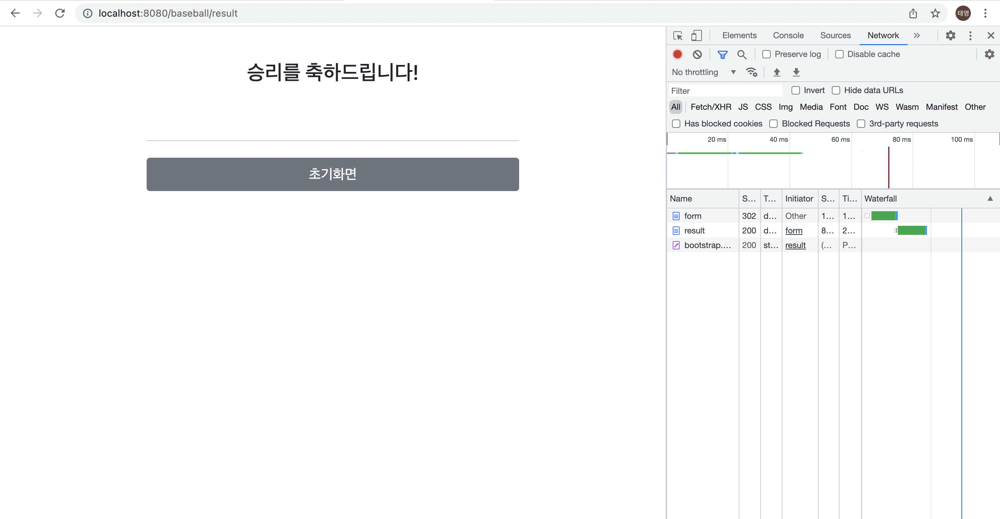
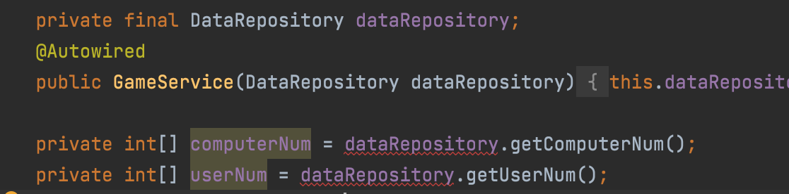

# 숫자야구 문제 스프링 MVC로 웹에 구현해보기

> 문제의 자세한 내용은 java_project_woowacoures 참고


## 작동 영상

<video src="baseball_run.mov"></video>




## 설계

- **Repository**
  - DataRepository
    - computerNum
    - userNum
    - strike
    - ball


- **Service**
  - ComputerService
    - 컴퓨터의 난수 생성하는 로직 (중복x, 지정된 범위내에서의 난수)
  - GameService
    - strike와 ball을 계산해 repository에 저장하고 필요할때 받아오는 로직
  - UserService
    - 사용자의 숫자 생성하는 로직 (3자리인지? 숫자인지? 중복이 있는지? 0이 있는지? 에 대한 예외처리)


- **Contorller**
  - ComputerController
    - 컴퓨터의 난수를 생성
  - GameController
    - 게임의 전반적인 진행
      - 게임의 초기화
      - strike와 ball을 계산하여 View로 보냄
      - 위 과정에서 게임의 종료조건을 확인하여 결과창으로 유도
  - UserController
    - 사용자로부터 받은 숫자 생성


- **View**
  - main 
    - 게임을 시작할 수 있는 메인화면
  - form
    - 사용자가 숫자를 입력하는 form
  - result
    - 결과화면을 나타내는 화면 (strike: ~ ball: ~)
  - end
    - 게임이 끝났음을 알리는 화면
  - error
    - 사용자가 잘못된 입력을 했을 때 오류임을 알려주는 화면


## 의존관계

- Repository → Service → Controller


## 마주했던 문제점들

- **어플리케이션 작동부터 실패한 첫번째 오류**

  - *Error creating bean with name 'gameController' defined in file [/Users/taeyoung/Desktop/project/spring_project_wooacourse/baseball/out/production/classes/practice/baseball/controller/GameController.class]: Unsatisfied dependency expressed through constructor parameter 0; nested exception is org.springframework.beans.factory.BeanCreationException:* 

  - 이 오류를 마주치고 열심히 **구글링**을 해봤는데 

    *'Unsatisfied dependency expressed through constructor parameter 0; nested exception is'*

    **순환 의존에 관한 에러**에 대해 알 수 있었다


    예를들어 빈에 등록된  A클래스에서 빈에 등록된 B클래스를 의존주입하는데,

    B클래스도 A클래스를 의존주입하려고 할 때 빈의 생성 순서가 일정하지 않기 때문에 서로가 서로를 의존하는 관계에서 발생하는 오류라고 한다. (어떤 느낌인진 이해했으나 이 이해 방향이 맞는지는...)

    

    이 에러를 보고 내 구조를 종이에 적어봤을 때 위 문제점은 보이지 않았다. 약 1시간 혼자 고민해보다가 **같이 공부하는 친구에게 도움을 요청**했고 토론과정을 거치며 문제점을 하나씩 짚어보기 시작했다.

    

    문제는 어처구니 없을 정도로 단순했다. 나의 치명적인 실수가 있었다.

    

    ```java
    private DataRepository dataRepository;
    ~~~
    ```

    로 작성되어있던 원래 코드에 `private`를 붙여봤더니 저렇게 컴파일 에러가 발생했는데, 왜인지 살펴보다가 말도 안되는 변수 선언이라는 것을 발견했다. (도움을 준 https://github.com/TaeyeonRoyce 에게 무한한 감사를,,)

    저 부분을 수정 한 후 어플리케이션이 정상 작동하게 되었다!


- **Controller ←→ View 에서의 문제**

  - 처음에 구조적인 설계를 모두 마치고 Controller ←→ View 부분의 구현이 잘 되었는지 링크만 연결한 뒤 테스트해보았다. 

    구조적으로 확인했을 때는 문제가  없다고 생각했는데 내 생각대로 매핑 되지 않았다. 

    아직 Controller에서 `Mapping` 과 `return View` 부분을 헷갈리는 것 같았다.

    Controller에서 각각의 메서드에 매핑할 땐 헷갈리지 않는데 경로가 여러개가 얽히니 

    자꾸만 `return ` 부의 **view경로**를 **매핑경로**로 오해하는 일이 자주 일어났다.

    결국 `redirect:` 를 통해 원하는 경로대로 매핑에 완료했으나 이것이 효율적인 구조인지 의문이 든다.

    이후에 여러 코드들을 보며 이런부분은 하나씩 개선해나가야겠다.


## 개선하고싶은 부분

- **구조적인 부분**

  - 내가 짠 구조가 효율적인 구조인지에 대한 의문이 끊이질 않는다. 

    1. MVC구조의 사용방법이 내가 사용하고있는 관계가 맞는지에 대한 의문

    2. 일단 프로그램이 정상적으로 작동하고, 구조를 그리며 확인해봤을 때 논리적인 오류는 크게 없는 것 같으나 실제로 프로그램을 설계할 때 이런식으로 설계하는지, 내가 짠 구조가 효율적인지에 대한 의문
    3. 위에서 말했듯 특히 Controller ←→ View 에서의 매핑관계를 어떤식으로 설계하는 것이 바람직할지 앞으로 스프링 MVC에 대한 공부를 이어나가며 학습하고싶다.


- **예외처리**

  - 현재 나같은 경우에는 예외처리를 

    *(/service/Userservice)*

    ```java
    public void createUserNum(String userInput){
            String[] userInputArr = isUserInputLength(userInput).split("");
            for(int i=0; i<USER_NUMBER_LEN; i++){
                userNum[i]=Integer.parseInt(userInputArr[i]);
            }
            dataRepository.setUserNum(userNum);
        }
    
        // 3자리 이상,이하 입력에 대한 예외처리
        private String isUserInputLength(String userInput) throws IllegalArgumentException {
            if(userInput.length() != 3) {
                throw new IllegalArgumentException("3자리로 입력하세요.");
            }
            return isUserInputDigit(userInput);
        }
    
        // 문자 입력에 대한 예외처리
        private String isUserInputDigit(String userInput) throws IllegalArgumentException {
            try {
                Integer.parseInt(userInput);
            } catch (NumberFormatException e) {
                throw new IllegalArgumentException("숫자만 입력하세요.");
            }
            return isUserInputDiffDigits(userInput);
        }
    
    // 이후 생략
    
    ```

    *(/controller/UserController)*

    ```java
    @PostMapping("/baseball/form")
        public String createUserNum(@RequestParam String userInput, RedirectAttributes redirectAttributes){
            try{
                userService.createUserNum(userInput);
            } catch (IllegalArgumentException e){
                redirectAttributes.addAttribute("status",true);
                redirectAttributes.addAttribute("errorMsg",e.getMessage());
                return "redirect:/baseball/error";
            }
            return "redirect:/baseball/result";
        }
    
    @GetMapping("/baseball/error")
        public String errorPage(){
            return "/baseball/error";
        }
    ```

    위와 같은 구조로 작성했다.

    `Service` 에서 예외를 던지고, `Controller` 에서 try-catch 구문을 통해 **에러가 잡히면 에러페이지로 리다이렉트** 하는 방향으로 설계했다. 이때 `RedirectAttribute` 와`e.getMassage` 를 통해 예외 상황에 맞게 에러메시지를 구현하긴 했으나, 

    처음에 예외처리를 위해 **스프링 예외처리** 내용을 **구글링** 했을 때 얻은 정보들을 아직 이해하기 힘들어 내 방식대로 구현해보았다. 

    강의에서도 수차례 나온 말이지만, 개발자는 예외처리와의 싸움이라는데 이후에 더 깊은 공부를 통해 **예외처리부분을 개선해보고싶다**.


- **테스트케이스의 작성**

  - 이번 프로젝트를 진행하기 전에  **테스트 케이스를 작성해보며 설계를 진행하리라** 마음먹었는데, 

    정신을 차려보니 테스트도 제대로 하지 않고 무지성(?)으로 코드를 다 적은 상태였다.

    물론 이번 프로젝트의 경우 로직은 이전에 구현한 경험이 있어 다행히 이쪽부분에서의 오류는 없었으나 (아직 발견하지 못한걸지도..?) 

    생소하거나 복잡한 프로젝트를 할 때 이렇게 테스트케이스를 작성하지 않는 습관이 있어 로직에서 오류가 발생했을 때 상상도 하고싶지 않다..

    아직 테스트 케이스를 작성하는 부분의 실력적인 미숙함도 있으니 **최대한 의식하고 테스트케이스를 작성해 봐야겠다**.


- **Service의 로직 효율성**

  - 내가 구현한 로직의 효율성 측면에 대한 의구심이 든다. 특히 `for`문을 이용하여 검증하는 부분은 `stream`으로 해결할 수 있을 것 같은데 아직 `stream`을 활용하는 단계에서는 실력적인 미숙함이 크다고 생각한다. 

    자바로는 알고리즘 문제를 거의 풀어보지 않아 이런 부분이 더 크게 부각되는 것 같다. **알고리즘을 게을리 하지 말아야겠다**.


- **Thymleaf 의 사용 미숙**
  - 구글링을 통해 여러 기능들을 확인해가며 작성했으나, 아직 익숙치않다. UI적인 측면을 더 개선할 수 있을 것 같은데 아직은 조금 힘들다. **꾸준히 공부하자**!


​		


