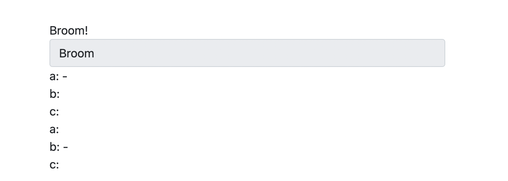
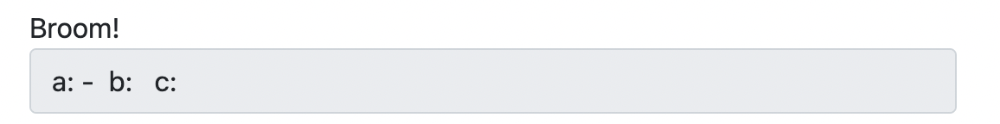
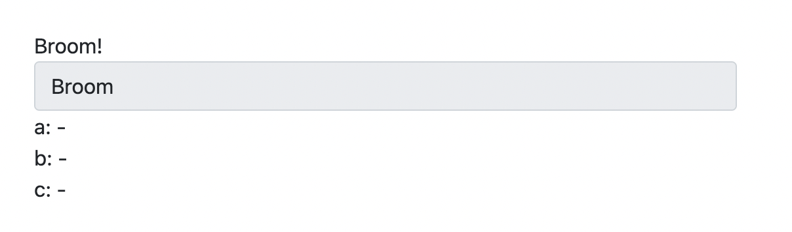

# 자동차 경주 문제 스프링 MVC로 웹에 구현해보기

> 문제의 자세한 내용은 java_project_woowacoures 참고


## 작동 영상


## 설계

- **Domain**
  - Car
    - name
    - progressNum *(진행도를 숫자로 저장)*
    - progressString *(진행도를 결과에 맞춰 저장)*
- **Repository**
  - GameRepository
    - cars *(경주에 참여하는 차를 객체배열로 저장)*
    - maxTryTimes *(경기 종료 시도횟수 저장)*
    - tryTime *(시도 횟수 저장)*
    - winner *(우승자 저장)*


- **Service**
  - SaveService
    - 사용자의 입력값을 받아 예외를 처리하고 저장하는 로직
  - GameService
    - 게임의 전반적인 진행을 담당하는 로직


- **Contorller**
  - SaveController
    - 사용자로부터 입력을 받는 부분 전담
    - 게임의 초기화
    - 에러페이지
    
  - GameController
    - 게임의 전반적인 진행
      - 게임의 시작
      
      - 게임의 진행
      
        > 매 시도 시 일어나는 일을 처리
      
      - 게임의 종료
      
        > 게임의 종료조건을 체크하고 우승자 출력


- **View**
  - main 
    - 게임을 시작할 수 있는 메인화면
  - form
    - 사용자가 레이스에 참여 할 자동차와 시도 횟수를 입력하는 화면
  - progress
    - 결과화면을 나타내는 화면 (매 시도 시)
  - result
    - 게임이 끝났음을 알리고 우승자를 출력하는 화면
  - error
    - 사용자가 잘못된 입력을 했을 때 오류임을 알려주는 화면


## 의존관계

- Repository → Service → Controller


## 마주했던 문제점들 & 해결과정

- **오류처리에 관한 부분**

  - 이전 '숫자야구' 게임에서 처럼 예외 처리를 진행했는데, 이번에는 예외 처리 방식에 관한 문제보다는 크게 **2가지** 문제를 만나게 되었다.

    1. **구조적인 문제**

       크게 총 두가지의 예외를 처리했어야 했다. **'사용자가 자동차를 입력'** & **'사용자가 시도횟수를 입력'**

       처음 예외처리를 작업한 부분이 **'사용자가 자동차를 입력'**하는 부분이었다. 

       Ropository에서 저장을 하기에 Service에서 Repository의 메서드를 호출하는 방법으로 구현을 진행했다.

       두번째 예외처리는 **'사용자가 시도횟수를 입력'** 부분이었다. 이 부분은 Service에서 처리하게 구현을 진행하게 되었다. 

       코드를 쭉 짜다가 정신을 차려보니 **처음 설계할 때 로직은 모두 Service에서 진행하기로 한 내 계획**과는 다르게  둘 다 예외처리에 관한 로직인데 **서로 다른 부분에서 처리하고 있는 내 코드**를 마주하게 되었다. 

       이때부터 급하게 리펙토링을 진행하게 되었고, 결과적으로는 예외를 처리하는 로직은 모두 Service에서 이루어지게 기능을 정리했다.

       

       이 문제를 해결하기 위해서 문제가 발생한 원인과 해결방안에 대해 고민해보았다.

       - **문제 :** 

         코드를 사용자가 게임을 진행하는 순서대로 작성해 나갔다. 그러다보니 기능 구현에 정신이 더 쏠려있었고, 설계와는 다른 구조로 코드를 작성하게 된 것 같다.

       - **해결방안 :** 

         게임을 진행하는 순서대로 코드를 작성하는 것이 아니라 **전체적인 로직을 크게 먼저 짜고 하나씩 구현**해 나가는 것이 더 바람직할 것 같다. 

         마치 인터페이스로 꼭 구현해야할 메서드를 미리 작성해두고, 그 인터페이스를 확장하여 메서드를 구현하듯이, 게임에 필요한 로직이 무엇이 있는지를 미리 정리하고 그 로직을 어디서 실행할지 먼저 생각한 후, 굵게 굵게 코드를 먼저 작성하는 것이다. 그 이후에 그 메서드를 채우는 것은 단순한 하나의 로직만을 처리하는 것이니 로직에서의 실수도 줄어들고 더 집중도 있게 할 수 있을 것 같다. 

         이후 Controller-View 에서는 이 방법대로 진행해서 이 방법이 더 효율적일 수 있음을 어느정도 확인했다. 

         

    2. **예외 처리 후 발생한 문제**

       게임의 단순한 구현을 마무리하고, 게임을 테스트하고 있던중 발견한 버그(?)다. 

       에러페이지가 잘 나오나 확인하기 위해 일부러 여러가지 예외상황을 집어넣고 예외 페이지가 잘 나오는 것을 확인하고 신나게 정상 케이스를 입력했다. 그러다가 버그를 마주했다.

       

       > 예외 케이스 (aaaaaaaaaa,b / 3) (a,b,c / 0)    정상 케이스 (a,b,c / 3) 입력

       결과창에 이렇게 나온것이다. 잠시 멘붕에 빠져있다가 왜 이런 문제가 발생했는지에 대해 코드를 분석했다. 

       찾은 원인은 이러하다. 

       *(자동차 이름 예외처리)*

       ```java
       // 사용자의 입력을 통해 자동차 객체 저장
           public void joinParticipants(String userInputCarsRaw) {
               log.info("save car");
               String[] userInputArr = checkValid(userInputCarsRaw);
               List<Car> cars = gameRepository.getCars();
               for(String carName : userInputArr){
                   cars.add(new Car(carName));
               }
               gameRepository.setCars(cars);
           }
       // 이하 예외처리 메서드
       ```

       *(시도횟수 예외처리)*

       ```java
       public int saveMaxTryTimes(String userInputTryTimes){
               gameRepository.setMaxTryTimes(Integer.parseInt(isUserInputDigit(userInputTryTimes)));
               log.info("save TryTimes");
               return gameRepository.getMaxTryTimes();
           }
       // 이하 예외처리 메서드
       ```

       처음에는 왜 (aaaaaaaaaa,b / 3) 케이스 관련 버그는 일어나지 않았을까 고민해봤을 때, 오류가 나면 객체를 저장하지 않기 때문임을 알게 되었다.

       잘 살펴보니 (a,b,c / 3 ) 케이스에서 **자동차를 입력 한 부분에서의 예외 처리는 통과해서 우선 Repository의 cars 에 객체로 저장이 되어버린 후**, 시도 횟수 관련 예외처리에 걸려 재입력을 받는 상황이었다. 그래서 오류로 걸러저야할 케이스임에도 불구하고 **객체는 저장되어 위 사진처럼 나오는 것**이었다.

       어떻게 해결해야할까 고민하다가 가장 쉽고 빠르게 처리할 수 있는 아이디어는 그냥 **에러페이지에 접근할 때 마다 초기화**해버리는 방향이었다. 그 코드를 추가하니 발견했던 버그는 사라졌다.

       이렇게 작은 프로젝트에서도 조금 꼬아 접근하니 손쉽게 버그가 난다는 것을 본 나는 앞으로의 내 모습이 조금 걱정되었다..

- **Thymeleaf  사용에 관한 문제**

  - 처음에 기능적인 구현을 하고있을 때 결과창에 나오는 내용이 마음에 들지 않았다. 아직 Thymeleaf의 사용에 익숙치 않은 나는 기본적인 구조에 값만 조금씩 변형하여 View를 만들고 있었는데 난관에 봉착한 것이다. 

    ```java
    // 레이스를 1번 시행한 결과를 리턴
        public String makeProgressResult(){
            List<Car> cars = gameRepository.getCars();
            String progressResult="";
            for(Car car : cars){
                progressResult+=(car.getName()+": "+car.getProgressString()+" \n ");
            }
            return progressResult;
        }
    ```

    로 작성했는데 화면에는 

    

    처럼 나온것이다.

    이유에 대해 찾아보니 \n은 어디까지나 일반 텍스트 문서 포맷에서의 줄바꿈이지 html 태그상에서의 줄바꿈이 아니기 때문이었다. 이를 해결하기위해 Thymeleaf의 문법을 공부해보았다. 

    그러다가 **'th:utext'** 라는 것을 알게되었고, 저기서 받은 값에 html을 작성하듯 값을 넣으면 된다는 것이었다. 

    ```java
    // 레이스를 1번 시행한 결과를 리턴
        public String makeProgressResult(){
            List<Car> cars = gameRepository.getCars();
            String progressResult="";
            for(Car car : cars){
                progressResult+=(car.getName()+": "+car.getProgressString()+"</br>");
            }
            return progressResult;
        }
    ```

    로 수정한 후 View에서 위 문법을 적용하니 원하는 방향대로 출력할 수 있었다.

    


## 개선하고싶은 부분

> 전반적으로 숫자야구와 크게 다르지 않다.. 내용의 반복일 것 같아 자세한 내용은 생략

- **구조적인 부분**

  - 숫자 야구에서는 Repository가 완전 단순히 내용을 저장하는 부분이라 getter setter을 지정한 이후 크게 신경쓸 부분이 없었다. 하지만 이번에는 단순히 정보를 저장하고 불러오는 기능만으로는 부족했다. 

    그래서 Repository 내부에서 기능을 수행하는 메서드를 작성하고, Service에서 그 메서드를 호출하고, Controller에서 Service를 호출하여 로직을 수행했는데, 아직 규모가 작아서 이런 고민이 생겼을 수도 있지만 뭔가 비효율적이라는 느낌이 들었다. 

    규모가 큰 경우 이렇게 역할을 분리해놓으면 유지보수에 유리할 것 같다는 생각도 들지만 현재로서는 이게 효율적인 구조인지, 아니면 내가 MVC구조를 잘못활용하고 있는지 조금 의문이 든다. 
  
    이런 구조적인 측면은 정말 잘하는 사람에게 코드리뷰를 받고싶다. 구글링으로는 내 코드에 구조적인 문제가 어떤것이 있는지 찾기가 너무 힘든 것 같다.
  
  

- **Service의 로직 효율성**


- **Thymleaf 의 사용 미숙**
  - 특히 progress 의 부분이 매우 아쉽다. 시작만 누르면 이후 과정이 자동으로 진행되게 만들어보고 싶었으나 방법을 찾지 못해서 매 시도마다 시도버튼을 눌러야 하는 방식으로 구현하였다.


## 이전 프로젝트보다 발전한 부분

> 미약하지만 나를 칭찬해보며 원동력을 얻어보자..!

- **테스트 케이스의 작성**

  - 모든 경우에 대해 테스트 케이스를 작성하진 않았으나 필수 로직에 대한 테스트는 진행했다. 

    스스로 가장 뿌듯한 부분은 처음으로 '로그'를 직접 사용해 보았다는 점이다. 

    객체를 실제로 저장하는 로직의 경우 하나의 클래스에서만 진행하면 됐는데, View에서부터 그 과정이 잘 진행되는지를 검증해보고 싶은데 내가 갖고있는 지식으로는 어떻게 작성해야할지 막막했다. 그러다 생각난게 로그였다. 검증된 로직까지 도달하는지를 로그로 남기면 그 이후 저장의 경우 이미 검증을 한 상태이기 때문이다. 

    

- **Thymeleaf 의 새로운 기능 발견**

  - 위에서 이야기한 th:utext 에 관한 부분
